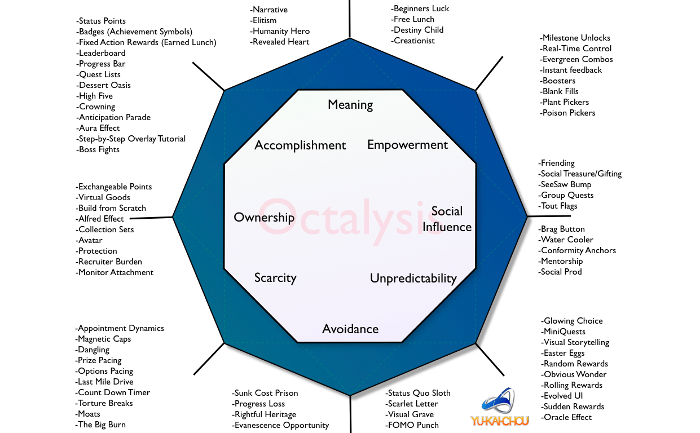

title=Actionable Gamification
tags=reading, books, gamedev
summary=Beyond points, badges, and leaderboards.
~~~~~~
*(by Yu-Kai Chou)*

# When the Surreal Blends Into Our World
(Author's personal history; feelings of emptiness after sinking thousands of hours into Diablo II.)

Designing my life then became a decade long journey of addressing two intriguing design questions:

1. How to make games more meaningful?
2. How to make life more fun?

## Why Gamification?
Charles Coonradt: "The Game of Work" (Paperback, Gibbs Smith, Layton, UT): "Why would people pay for the privilege of working harder at their chosen sport or recreational pursuit than they would at a job where they were being paid?" He boiled it down to five conclusions:

* Clearly defined goals
* Better scorekeeping and scorecards
* More frequent feedback
* A higher degree of personal choice of methods
* Consistent coaching

## Human-Focused Design: The Better Term for Gamification
Gamification is the craft of deriving fun and engaging elements found typically in games and thoughtfully applying them to real-world or productive activities. This is "Human-Focused Design", in opposition to "Function-Focused Design." *Human-Focused Design optimizes for human motivation in a system as opposed to optimizing for pure functional efficiency within the system.* The reason we call this design discipline is beecause the gaming industry was the first to master Human-Focused Design.

Games have no other purpose than to please the humans playing them. The harsh reality of game designers is that no one ever has to play a game. They have to go to work, do their taxes, and play their bills, but they don't have to play a game.

# The PBL Fallacy

## A Story About Social Media
*(Setting up a maturity parallel between social media and gamification industry)*

What most people didn't recognize [in the early days of social media] was that [it] is much deeper than simply possessing and posting on profile accounts. *Today we know that great social media campaigns focus on how to create value for the audience by sharing information that is insightful and engaging, has a personal voice, engages and sincerely interacts with each potential customer, and much, much more. It is the informal and formal dialogue you have with your community that ultimately taps into the platform's unique possibilities.*

The early days of social media almost completely mirror the gamification industry today.

## An Obsession with Grunt Work
*(Tapping into intrinsic motivations)*

Do games really have the power to motivate people? "Kids today don't have strong work ethics." But when it comes to playing games, these same kids have amazing work ethics. They'll grind for hours doing grunt work.

## Secondhand Sushi Making
*(There are many who have never "done" claiming expertise)*

Once gamification became a buzzword, it attracted many who saw it as an opportunity to corner an emerging industry. As a result, many gamification professionals focus only on developing the superficial layer of games; the "shell of a game experience", manifested as PBLs: Points, Badges, and Leaderboards. Many gamification professionals believe that if you put points on something boring, add some badges, and provide a competitive leaderboard, that once-boring product will automatically beome exciting.

If you ask any gamer what makes a game fun, they will not tell you it is because of the PBLs. They play it because there are elements of strategy and great ways to spend time with friends, or they want to challenge themselves to overcome difficult obstacles. *(Extrinsic vs intrinsic motivation.)*

**Simply incorporating game mechanics and game elements does make a game fun.**

## The Story of the Good Designer vs Bad Designer
How a bad designer might design a game: doesn't focus on their users' motivations first.

How a good designer might design a game: "How do I want my users to feel? Do I want them to feel inspired? Do I want them to feel proud? Should they be scared? Anxious? What's my goal for their intended experience?"

# The Octalysis Framework

([Source](https://yukaichou.com/gamification-examples/octalysis-complete-gamification-framework/))

When there are none of these 8 Core Drives behind a Desired Action, there is zero motivation and no action takes place. The placement determines the nature of the motivation (left-brained on the left, right-brained on the right). Interestingly, Left Brain Core Drives tend to rely on extrinsic motivation--you are motivated because you want to obtain something. Right Brain Core Drives are mostly associated with intrinsic motivations--you don't need a goal or reward, the activity is rewarding on its own.

The top Core Drives are considered very positive motivations ("White Hat"), while the bottom Core Drives are considered to be more negative ("Black Hat").

**The Hidden Ninth Core Drive: Sensation**: the physical pleasure one obtains from taking an action. Sensation deals with physical feelings whereas the other Eight Core Drives bring pleasure to us through psychological means.

**How to apply Level 1 Octalysis to Actual Systems**: Use it to analyze the strengths and weaknesses of various products and experiences with respect to motivation. The key is to start thinking about how that product or experience utilizes each of the 8 Core Drives, and identify all the game mechanics and techniques that are used to activate them. Use the [Octalysis tool](http://www.yukaichou.com/octalysis-tool) to chart them out.

**Level 2 Octalysis:** Where we try to optimize experiences through all four phases of the player/user journey: *Discovery* (why people would even want to try out the experience), *Onboarding* (where users learn the rules and tools to play the game), *Scaffolding* (the regular journey of repeated actions towards a goal), and *Endgame* (how do you retain your veterans).

**Level 3 Octalysis:** Factoring in the different player types (such as using Bartle's Four Player Types--Achievers, Explorers, Socializers, Killers, as one possible y-axis).

# Putting Gamification in its Place

# The First Core Drive: Epic Meaning & Calling

# The Second Core Drive: Development & Accomplishment

# The Third Core Drive: Empowerment of Creativity & Feedback

# The Fourth Core Drive: Ownership & Possession

# The Fifth Core Drive: Social Influence & Relatedness

# The Sixth Core Drive: Scarcity & Impatience

# The Seventh Core Drive: Unpredictability & Curiosity

# The Eight Core Drive: Loss & Avoidance

# Left Brain vs Right Brain Core Drives

# The Mysteries of White Hat and Black Hat Gamification

# Understanding Other Gamification and Behavioral Frameworks with Octalysis

# Level I Octalysis in Action

# Designing a project from scratch with Octalysis

---

# 4 Phases of a Player’s Journey

# 4 Experience Phases in Gamification (#1): The Discovery Phase
# 4 Experience Phases in Gamification (#2): The Onboarding Phase
# 4 Experience Phases in Gamification (#3): The Scaffolding Phase
# 4 Experience Phases in Gamification (#4): The Endgame Phase
# Lifestyle Gamification: How to Convert your Life into a Game
# 4 Steps to Master Lifestyle Gamification
# User and Player Types in Gamified Systems
# The Six Contextual Types of Rewards in Gamification
# Gamified Competition in The Enterprise Workplace