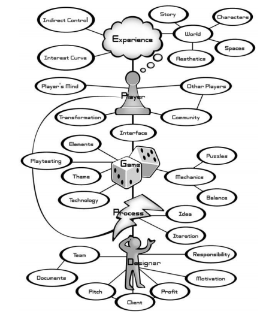

title=Art of Game Design
tags=reading, books, gamedev
summary=An introduction to game design.
~~~~~~
*(by Jesse Schell (Morgan-Kaufman, 2008 ISBN 978-0-12-369496-6))* 

# In the Beginning, There Is the *Designer*
What skills does a game designer need?

* Animation
* Anthropology
* Architecture
* Brainstorming
* Business
* Cinematography
* Communication
* Creative Writing
* Economics
* Engineering
* History
* Management
* Mathematics
* Music
* Psychology
* Public Speaking
* Sound Design
* Technical Writing
* Visual Arts

The most important skill: Listening. The Five Kinds of Listening: to your team, to your audience, to your game, to your client, and to your self.

# The Designer Creates an *Experience*

The game is not the experience; the game enables the experience, but it is not the experience itself. "If a tree falls in the forest, and no one is around to hear it, does it make a sound?" If "sound" is the experience of hearing a noise, then the answer is no, it doesn't. Game designers only care about what *seems* to exist.

Three practical approaches to chasing rainbows: psychology, anthropology, design (musicians, architects, authors, filmmakers, industrial designers, Web designers, choreographers, visual designers, and more).

Introspection: Powers, Perils, and Practice

* Peril #1: Introspection can lead to false conclusions about reality.

* Peril #2: What is true of my experiences may not be true for others.

* Dissect your feelings. *Why* you feel a certain way, not just feeling it.

* Heisenburg (observing a thing interferes with the thing) and experience. To defeat Heisenburg...
    * Analyze memories.
    * Two passes. Run through the experience twice.
    * Sneak glances. Take a few short glances at the experience, but don't analyze in depth.
    * Observe silently.

**Lens #1: The Lens of Essential Experience**

# The Experience Rises Out of a *Game*
How do we define a "game"?

**Lens #2: The Lens of Surprise** 

**Lens #3: The Lens of Fun**

**Lens #4: The Lens of Curiosity**

Key qualities of games:

1. Games are entered willfully.
2. Games have goals.
3. Games have conflict.
4. Games have rules.
5. Games can be won and lost.
6. Games are interactive.
7. Games have challenge.
8. Games can create their own internal value.
9. Games engage players.
10. Games are closed, formal systems.

**Lens #5: The Lens of Endogenous Value**

**Lens #6: The Lens of Problem Solving**

The Fruits of our Labors (defining a game):

* Fun is pleasure with surprises.
* Play is manipulation that satisfies curiosity.
* A toy is an object you play with.
* A good toy is an object that is fun to play with.
* A game is a problem-solving activity, approached with a playful attitude.

# The Game Consists of *Elements*
The Four Basic Elements:

* **Mechanics**: The procedures and rules of your game.
* **Story**: The sequence of events that unfolds in your game.
* **Aesthetics**: How your game looks, sounds, smells, tastes, and feels.
* **Technology**: Any materials an interactions that make your game possible, such as paper and pencil, plastic chits, or high-powered lasers.

**Lens #7: The Lens of the Elemental Tetrad**

**Lens #8: The Lens of Holographic Design**

# The Elements Support a *Theme*
Unifying themes; step 1, figure out what your theme is; step 2, use every means possible to reinforce that theme.

**Lens #9: The Lens of Unification**

Some themes are better than others because they resonate with people more closely.

**Lens #10: The Lens of Resonance**

# The Game Begins with an *Idea*
Inspiration: don't look to the others around you, look everywhere else.

**Lens #11: The Lens of Infinite Inspiration**

**State the Problem**. Get the problem statement right. This creates three advantages:

* **Broader creative space.**
* **Clear measurement.**
* **Better communication.**

**Lens #12: The Lens of the Problem Statement**

## Your Subconscious
* Common characteristics: Can't talk (or chooses not to); Impulsive; Emotional; Playful; Irrational
* Subconscious Tip #1: Pay Attention
* Subconscious Tip #2: Record Your Ideas
* Subconscious Tip #3: Manage Its Appetites (Judiciously)
* Subconscious Tip #4: Sleep
* Subconscious Tip #5: Don't Push Too Hard

## Fifteen Nitty-Gritty Brainstorming Tips

1. The Write Answer: write them (all) down.
2. Write or Type?: whatever works best.
3. Sketch
4. Toys
5. Change Your Perspective
6. Immerse Yourself
7. Crack Jokes
8. Spare No Expense
9. The Writing on the Wall
10. The Space Remembers
11. Write Everything
12. Number Your Lists
13. Mix and Match Categories
        * Technology Ideas: Cell-phone platform; Handheld game; PC; Integrated with SMS; Game console; ...
        * Mechanics Ideas: Sims-like game; Interactive fiction game; The winner makes the most friends; Try to spread rumors about the other players; Try to help as many people as possible; Tetris-like game; ...
        * Story Ideas: High-school drama; College-themed; You play cupid; You're a TV star; Hospital theme; Music theme--you're a rock star, you're a dancer; ...
        * Aesthetic Ideas: Cel shaded; Anime style; All characters are animals; R&B music defines the game; Edgy rock/punk music defines the feel
14. Talk To Yourself
15. Find a Partner

# The Game Improves Through *Iteration*
The Eight Filters; only when your idea passes through each of these is it "good enough":

1. **Artistic Impulse.** Ask yourself if the game "feels right" to you. **Does this game feel right?**
2. **Demographics.** Consider whether the design is right for the demographic you are targeting. **Will the intended audience like this game well enough?**
3. **Experience Design.** Take into account everything you know about creating a good experience, including aesthetics, interest curves, resonant theme, game balancing, and many more. **Is this a well-designed game?**
4. **Innovation.** There needs to be something new about it. **Is this game novel enough?**
5. **Business and Marketing.** **Will this game sell?**
6. **Engineering.** How are we going to build this? **Is it technically possible to build this game?**
7. **Social/Community.** **Does this game meet our social and community goals?**
8. **Playtesting.** **Do the playtesters enjoy the game enough?**

**Lens #13: The Lens of the Eight Filters**

The Rule of the Loop: The more times you test and improve your design, the better your game will be.

* How can I make every loop count?
* How can I loop as fast as possible?

**Lens #14: The Lens of Risk Mitigation**

Eight Tips for Productive Prototyping:
1. Answer a Question.
2. Forget Quality
3. Don't Get Attached
4. Prioritize Your Prototypes
5. Parallelize Prototypes Productively
6. It Doesn't Have to be Digital
7. Pick a "Fast Loop" Game Engine
8. Build the Toy First

**Lens #15: The Lens of the Toy**

How much is enough? The Method makes an interesting distinction between what (game designer) Mark Cerny calls "pre-production " and "production" (terms borrowed from Hollywood). He argues that you are in pre-production until you have finished two publishable levels of your game, complete with all necessary features. In other words, until you have two completely finished levels, you are still figuring out the fundamental design of your game. Once you reach this magic point, you are now in production. This means that you know enough about what your game really is that you can safely schedule the rest of development. Cerny states that usually this point is generally reached when 30% of the necessary budget has been spent.

# The Game is Made for a *Player*
You must know what your audience will and will not like.

## Demographics
* **0-3: Infant/Toddler.** Very interested in toys (not games).
* **4-6: Preschooler.** Games are very simple, and played with parents.
* **7-9: Kids.** The age of seven is "the age of reason"; this is when kids are learning to read, able to think things through, and begin making their own decisions.
* **10-13: Preteen or 'Tween'.** Going through a period of neurological growth and are suddenly able to think about things more deeply and with more nuance. "The Age of Obsession".
* **13-18: Teen.** Start getting ready for adulthood. We see a significant divergense in interests between males and females; boys continue-to/grow-more interested in competition and mastery; girls become more focused on real-world issues and communication.
* **19-24: Young Adult.** Adults in general play less than children do. Young adults usually have time and money on their hands, making them big consumers of games.
* **25-35: Twenties and Thirties.** Time starts to beome more precious. "The Age of Peak Family Formation." Most adults in this age bracket are only casual game players, but "hardcore gamers" are an important target market.
* **35-50: Thirties and Forties.** The "family maturation stage"; only casual game players.
* **50+: Fifties and Up.** The "empty nesters", suddenly have a lot of time on their hands.

Five Things Males Like to See in Games:

1. **Mastery.** It doesn't have to be useful, only challenging.
2. **Competition.**
3. **Destruction.**
4. **Spatial Puzzles.** Puzzles that involve navigating 3D spaces are often quite intriguing.
5. **Trial and Error.** Males tend to have a preference for learning things through trial and error.

Five Things Females Like to See in Games:

1. **Emotion.** Experiences that explore the richness of human emotion.
2. **Real World.** Entertainment that connects meaningfully to the real world.
3. **Nurturing.**
4. **Dialog and Verbal Puzzles.**
5. **Learning by Example.**

**Lens #16: The Lens of the Player**

## Psychographics
Leblanc's Taxonomy of Game Pleasures

1. **Sensation.**
2. **Fantasy.**
3. **Narrative.**
4. **Challenge.**
5. **Fellowship.**
6. **Discovery.**
7. **Expression.**
8. **Submission.**

Bartle's Taxonomy of Player Types

* (Diamond) **Achievers** want to achieve the goals of the game. Their primary pleasure is Challenge.
* (Spade) **Explorers** want to get to know the breadth of the game. Their primary pleasure is Discovery.
* (Heart) **Socializers** are interested in relationships with other people. They primiarily seek the pleasures of Fellowship.
* (Club) **Killers** are interested in competing with and defeating others. 

A few more pleasures to be considered (beyond the two taxonomies):

* **Anticipation.**
* **Delight in Another's Misfortune.** *schadenfreude*
* **Gift Giving.**
* **Humor.**
* **Possibility.**
* **Pride in an Accomplishment.**
* **Purification.** Making something clean or "clear the level".
* **Surprise.**
* **Thrill.**
* **Triumph over Adversity.**
* **Wonder.**

**Lens #17: The Lens of Pleasure**

# The Experience is in the *Player's Mind*
Psychology: understanding an opaque system that we are intrinsically immersed in.

## Modeling
The only way our minds are able to get by at all is by simplifying reality so that we can make some sense of it. Correspondingly, our minds do not deal with reality itself, but instead with models of reality. [Philosophy: the map is not the terrain.] Reality is full of aspects that aren’t at all part of our day-to-day modeling. Consider Charlie Brown [or any other cartoon character], there's nothing "real" about him.

## Focus
One crucial technique our brains use to make sense of the world is the ability to focus its attention selectively, ignoring some things, and devoting more mental power to others. What we focus on at any given moment is determined through a blend of our unconscious desires and our conscious will. When we create games, our goal is to create an experience interesting enough that it holds the player’s focus as long and as intensely as possible. When something captures our complete attention and imagination for a long period, we enter an interesting mental state. This state of sustained focus, pleasure, and enjoyment is referred to as "flow". Some of the key components necessary to create an activity that puts a player into a flow state are:

* **Clear goals.** When our goals are clear, we are able to more easily stay focused on our task. When goals are unclear, we are not "into" our task, for we aren’t at all certain whether our current actions are useful.
* **No distractions.** Distractions steal focus from our task. No focus, no flow.
* **Direct feedback.** If every time we take an action, we have to wait before we know what effect the action caused, we will quickly become distracted and lose focus on our task. When feedback is immediate, we can easily stay focused.
* **Continuously challenging.** Human beings love a challenge. But it must be a challenge we think we can achieve. If we start to think we can’t achieve it, we feel frustrated, and our minds start seeking an activity more likely to be rewarding. On the other hand, if the challenge is too easy, we feel bored, and again, our minds start seeking more rewarding activities. 

Flow activities must manage to stay in the narrow margin of challenge that lies between boredom and frustration, for both of these unpleasant extremes cause our mind to change its focus to a new activity. Csikszentmihalyi calls this margin the "flow channel."

**Lens #18: The Lens of Flow**

## Empathy
As human beings, we have an amazing ability to project ourselves into the place of others. When we do this, we think the other person’s thoughts and feel their feelings, to the best of our ability. It is one of the hallmarks of our ability to understand one another that we can do this, and it is an integral part of gameplay. Of course, the brain does all this using mental models — in truth, we are empathizing not with real people or animals, but with our mental models of them — which means we are easily tricked. We can feel emotion when there is none. A photo, a drawing, or a videogame character can just as easily capture our empathy. As game designers, we will make use of empathy in the same ways that novelists, graphic artists, and filmmakers do, but we also have our own set of new empathic interactions. Games are about problem solving, and empathic projection is a useful method of problem solving.

## Imagination
Imagination puts the player into the game by putting the game into the player.

For example, if I tell you a short story: "The mailman stole my car yesterday," I have actually told you very little, but already you have a picture of what happened. Weirdly, your picture is full of details that I didn’t include in my story. Take a look at the mental image that formed, and answer these questions:

* What did the mailman look like?
* What kind of neighborhood was my car in when he stole it?
* What color was the car?
* What time of day did he steal it?
* How did he steal it?
* Why did he steal it?

Now, I didn’t tell you any of those things, but your amazing imagination just made up a bunch of these details so that you could more easily think about what I was telling you. Now, if I suddenly give you more information, like, "It wasn’t a real car, but an expensive model toy car," you quickly reformulate your imaginary image to fit what you have heard, and your answers to the above questions might change correspondingly.

## Motivation
[Maslow's Pyramid]

**Lens #19: The Lens of Needs**

## Judgment
The fourth level of Maslow’s hierarchy, self-esteem, is the one most intimately connected to games. But why? One deep need common to everyone is the need to be judged. (People don't hate being judged--they hate being judged unfairly.)

**Lens #20: The Lens of Judgment**

# Some Elements are *Game Mechanics*

# Game Mechanics Must be in *Balance*

# Game Mechanics Support *Puzzles*

# Players Play Games Through an *Interface*

# Experiences can be Judged by their *Interest Curves*

# One Kind of Experience is *Story*

# Story and Game Structures can be Arfully Merged with *Indirect Control*

# Stories and Games Take Place in *Worlds*

# Worlds Contain *Characters*

# Worlds Contain *Spaces*

# The Look and Feel of a World Is Defined by Its *Aesthetics*

# Some Games are Played with *Other Players*

# Other Players Sometimes Form *Communities*

# The Designer Usually Works with a *Team*

# The Team Sometimes Communicates Through *Documents*

# Good Games Are Created Through *Playtesting*

# The Team Builds a Game with *Technology*

# Your Game Will Probably Have a *Client*

# The Designer Gives the CLient a *Pitch*

# The Designer and Client Want the Game to Make a *Profit*

# Games *Transform* Their Players

# Designers Have Certain *Responsibilities*

# Each Designer has a *Motivation*

# Final Graphic

# The Lenses
1. **The Lens of Essential Experience:** To use this lens, you stop thinking about your game and start thinking about the experience of the player. What experience do I want the player to have? What is essential to that experience? How can my game capture that essence? If there is a big different between the experience you want to create and the one you are actually creating, your game needs to change: You need to clearly state the essential experience you desire, and find as many ways as possible to instill this essence into your game.

2. **The Lens of Surprise:** Surprise is so basic that we can easily forget about it. Use this lens to remind yourself to fill your game with interesting surprises. What will surprise players when they play my game? Does the story in my game have surprises? Do the game rules? Does the artwork? The technology?

3. **The Lens of Fun:** Fun in desirable in nearly every game, although sometimes fun defeats analysis. What parts of my game are fun? Why? What parts need to be more fun?

4. **The Lens of Curiosity:** Think about the player's true motivations*not just the goals your game has set forth, but the reason the player wants to achieve those goals. What questions does my game put into the player's mind? What am I doing to make them care about these questions? What can I do to make them invent even more questions? For example, a maze-finding video game might have a time-limit goal such that at each level, players are trying to answer the question "Can I find my way through this maze in 30 seconds?" A way to make them care more would be to play interesting animations when they solve each maze, so players might also ask the question, "I wonder what the next animation will be?"

5. **The Lens of Endogenous Value:** Think about your players' feelings about items, objects, and scoring in your game. What is valuable to the players in my game? How can I make it more valuable to them? What is the relationship between value in the game and the player's motivations? Remember, the value of items and score in the game is a direct reflection of how much players care about succeeding in your game. By thinking about what the players really care about and why, you can often get insights about how your game can improve.

6. **The Lens of Problem Solving:** Think about the problems your players must solve to succeed at your game, for every game has problems to solve. What problems does my game ask the player to solve? Are there hidden problems to solve that arise as part of gameplay? How can my game generate new problems so that players keep coming back?

7. **The Lens of the Elemental Tetrad:** Take stock of what your game is truly made of. Consider each element separately, and then all of them together as a whole. Is my game design using elements of all four types? Could my design be improved by enhancing elements in one or more of the categories? ARe the four elements in harmony, reinforcing each other, and working together toward a common theme?

8. **The Lens of Holographic Design:** You must see everything in your game at once: the four elements and the player experience, as well as how they interrelate. It is acceptable to shift your focus from skin to skeleton and back again, but it is far better to view your game and experience holographically. What elements of the game make the experience enjoyable? What elements of the game detract from the experience? How can I change game elements to improve the experience?

9. **The Lens of Unification:** Consider the reason behind it all. What is my theme? Am I using every means possible to reinforce the theme? This works very well with the Lens of the Elemental Tetrad. Use the tetrad to separate out the elements of your game, so you can more easily study them from the perspective of a unified theme.

10. **The Lens of Resonance:** You must look for hidden power. What is it about my game that feels powerful and special? When I describe my game to people, what ideas get them really excited? If I had no constraints of any kind, what would this game be like? I have certain instincts about how this game should be. What is driving those instincts? This lens is a quiet, delicate instrument. It is a tool for listening to yourself and listening to others. We bury important things deep inside ourselves, and when something causes them to resonate, it shakes us to our very core. The fact that these things are hidden gives them power, but also makes them hard to find.

11. **The Lens of Infinite Inspiration:** "When you know how to listen, everybody is the guru." (Ram Dass) Stop looking at your game, and stop looking at games like it. Instead, look everywhere else. What is an experience I have had in my life that I would want to share with others? In what small way can I capture the essence of that experience and put it into my game? Using this lens requires an open mind and a big imagination. You need to search your feelings and observe everything around you. You must be willing to try the impossible--for surely it is impossible for a roll of the dice to capture the excitement of a swordfight, or for a video game to make a player feel afraid of the dark--isn't it? Use this lens to find the non-game experiences that will inspire your game. Your choices in the different quadrants of the tetrad can each by united by a single inspiration, or each can build on different inspirations, blending them together to create something entirely new. When you have concrete visions based on real life that guide your decision making, your experience will acquire an undeniable power, strength and uniqueness. This lens works hand in hand with Essential Experience. Use the Infinite Inspiration to seek and find beautiful experiences, and the Essential Experience to bring them into your game.

12. **The Lens of the Problem Statement:** Think of your game as the solution to a problem. What problem, or problems, am I really trying to solve? Have I been making assumptions about this game that really have nothing to do with its true purpose? Is a game really the best solution? Why? How will I be able to tell if the problem is solved? Defining the constraints and goals for your game as a problem statement can help move you to a clear game design much more quickly.

13. **The Lens of the Eight Filters:** You must consider the many constraints your design must satisfy. You can only call your design finished when it can pass through all eight filters without requiring a change.
    
    1. Artistic impulse. Does this game feel right?
    2. Demographics. Will the intended audience like this game enough?
    3. Experience Design. Is this a well-designed game?
    4. Innovation. Is this game novel enough?
    5. Business and Marketing. Will this game sell?
    6. Engineering. Is it technically possible to build this game?
    7. Social/Community. Does this game meet our social and community goals?
    8. Playtesting. Do the play testers enjoy the game enough?

14. **The Lens of Risk Mitigation:** Stop thinking positively, and start seriously considering the things that could go horribly wrong with your game. What could keep this game from being great? How can we stop that from happening? Risk management is hard. It means you have to face up to the problems you would most like to avoid, and solve them immediately. But if you discipline yourself to do it, you'll loop more times, and more usefully, and get a better game as a result. It is tempting to ignore potential problems and just work on the parts of your game you feel most confident about. You must resist this temptation and focus on the parts of your game that are in danger.

15. **The Lens of the Toy:** Stop thinking about whether your game is fun to play, and start thinking about whether it is fun to play *with*. Ask yourself these questions:

    * If my game had no goal, would it be fun at all? If not, how can I change that?
    * When people see my game, do they want to start interacting with it, even before they know what to do? If not, how can I change that?

    There are two ways to use this lens. One way is to use it on an existing game, to figure out how to add more toy-like qualities to it--that is, how to make it more approachable, and more fun to manipulate. The second way (the braver way) is to use it to invent and create new toys before you even have any idea what games will be played with them. This is risky if you are on a schedule--but if you are not, it can be a great "divining rod" to help you find wonderful games you might not have discovered otherwise.

16. **The Lens of the Player:** Stop thinking about your game, and start thinking about your player. Ask yourself these questions about the people who will play your game:

    * In general, what do they like?
    * What don't they like? Why?
    * What do they expect to see in a game?
    * If I were in their place, what would I want to see in a game?
    * What would they like or dislike about my game in particular?

    A good game designer should always be thinking of the player, and should be an advocate for the player. Skilled designers hold The Lens of the Player and the Lens of Holographic Design in the same hand, thinking about the player, the experience of the game, and the mechanics of the game all at the same time. THinking about hte player is useful, but evne more useful is watching them play your game. The more you observe them playing, the more easily you'll be able to predict what they are going to enjoy.

17. **The Lens of Pleasure:** Think about the kinds of pleasure your game does and does not provide. Ask yourself these questions:

    * What pleasures does your game give to players? Can these be improved?
    * What pleasures are missing from your experience? Why? Can they be added?

    The job of a game is to give pleasure. Always be on the lookout for unique, unclassified pleasures not found in most games--for one of these might be what gives your game the unique quality it needs.

18. **The Lens of Flow:** Consider what is holding your player’s focus. Ask yourself these questions:

    * Does my game have clear goals? If not, how can I fix that?
    * Are the goals of the player the same goals I intended?
    * Are there parts of the game that distract players to the point they forget their goal? If so, can these distractions be reduced, or tied into the game goals?
    * Does my game provide a steady stream of not-too-easy, not-too-hard challenges, taking into account the fact that the player’s skills may be gradually improving?
    * Are the player’s skills improving at the rate I had hoped? If not, how can I change that? 

19. **The Lens of Needs:** Stop thinking about your game, and start thinking about what basic human needs it fulfills. Ask yourself these questions:

    * On which levels of Maslow’s hierarchy is my game operating?
    * How can I make my game fulfill more basic needs than it already is?
    * On the levels my game is currently operating, how can it fulfill those needs even better?

    It sounds strange to talk about a game fulfilling basic human needs, but everything that people do is an attempt to fulfill these needs in some way. And keep in mind, some games fulfill needs better than others — your game can’t just promise the need, it must deliver fulfillment of the need. If a player imagines that playing your game is going to make them feel better about themselves, or get to know their friends better, and your game doesn’t deliver on these needs, your player will move on to a game that does. 

20. **The Lens of Judgment:** To decide if your game is a good judge of the players, ask yourself these questions:

    * What does your game judge about the players?
    * How does it communicate this judgment?
    * Do players feel the judgment is fair?
    * Do they care about the judgment?
    * Does the judgment make them want to improve?

